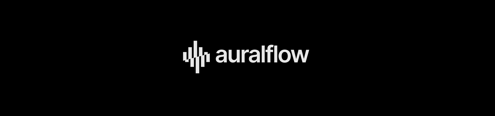
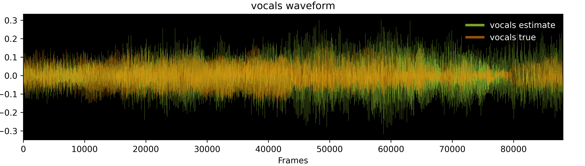

[](https://colab.research.google.com/drive/16IezJ1YXPUPJR5U7XkxfThviT9-JgG4X?usp=sharing)



# Auralflow: A BSS Modeling Toolkit For PyTorch
Auralflow is **blind source separation (BSS)** modeling toolkit designed for 
training deep convolutional autoencoder networks that isolate _stems_ (e.g. vocals)
from music tracks and recorded audio. The package offers the following:
- pretrained deep mask estimators (downloadable model weights)
- dataset classes that efficiently handle chunking of long audio clips
- loss functions (e.g. component loss, Si-SDR loss, etc.)
- PyTorch modules and wrapper classes that handle pre/post processing
- a high-level trainer class for training models
- visualization tools for viewing spectrograms and waveforms
- data processing tools
- GPU-accelerated MIR evaluation (e.g. Si-SDR, Si-SNR, etc.)
- separate folders of audio

It offers ready-to-go, pretrained DL models capable of separating
music tracks into multiple sources: vocals, bass, drums and other. Auralflow
also provides customizable base model architectures, which can be trained 
natively in auralflow or ported to your own custom training pipeline. 
Several convenient training, audio processing, visualization
and evaluation tools are available for a more seamless and efficient workflow.

* [Introduction: Music Source Separation](#introduction)
* [Pretrained Models](#pretrained-models)
* [Installation](#installation)
* [Command Line Usage](#usage)
  * [Model Configuration](#model-config)
  * [Running Training](#running-training)
  * [Separating Audio](#separating-audio)
* [Notebook Demo](#demo)
* [API Documentation](#documentation)
* [Deep Mask Estimation: More on the Mathematics](#deep-mask-estimation)
* [Contribution](#contribution)
* [License](#license)

TODO:
- [ ] testing
- [ ] train audio-domain models
- [ ] documentation
- [ ] package distribution

## Introduction: Music Source Separation <a name="introduction"></a>

Source separation is the process of separating an input signal into
separate signals that compose it. In the simplest terms, a signal is a linear
combination of vectors that belong to a (potentially huge dimensional) sub space. 

In the context of music and
machine learning, we can think of music source separation as the task of
determining a rule for splitting an audio track (referred to as a *mixture*)
into its solo instrument signals (each referred to as a  *stem*). While in
theory a perfect decomposition of a mixture would amount to some linear
combination of its source signals, the existence of noise and uncertainty
— both in the digital representation of an audio recording and modeling
— forces us to approximate the source signals. Fortunately, much like small,
imperceivable perturbations in image pixels, some noises are too subtle
in gain, or even completely outside of the frequency range amenable to the
human ear.

Currently, the two most popular methodologies of extracting these source
signals involve source mask estimation in the time-frequency
or ***spectrogram*** domain, and signal reconstruction directly in the
waveform or time-only domain. The former process, while requiring intermediate
data pre-processing and post-processing steps
(introducing noise and uncertainty) allows for more precise learning of
features related to signal frequencies, while the latter process works with
a simpler data representation, but attempts to solve a more difficult task
of reconstructing source signals entirely.

Music source separation is considered a sub-task within the larger branch of
**Music Information Retrieval (MIR)**, and is related to problems like
**speech enhancement**.

While deep mask estimation is theoretically quite similar to semantic
segmentation, there are some aspects related to digital signal processing
(i.e. fourier transform, complex values, phase estimation, filtering, etc.)
that go beyond the scope of deep learning. Thus, the purpose of this package
is to abstract away some of those processes in order to enable faster model
development time and reduce barriers to entry.

## Pretrained Models <a name="pretrained-models"></a>
Auralflow includes several base model architectures that have already been
trained on the musdb18 dataset. The table below compares each model relative to
its **scale-invariant signal-to-distortion ratio (____SI-SDR____)**,
which is averaged across audio tracks from a hidden test set. The choice of using the SI-SDR
over the typical SDR is because it's an unbiased and fairer measurement. 

| Base Model               | # Parameters (MM) | Pretrained | Trainable | Performance (si-sdr in db) |
|--------------------------|-------------------|------------|-----------|----------------------------|
| SpectrogramNetSimple     | 7.9               | yes        | yes       | + 2.9                      |
| SpectrogramNetLSTM       | 32.3              | yes        | yes       | +4.3                       |
| **SpectrogramNetVAE***   | **40**            | yes        | yes       | **+5.4**                   |

**\*-Simple** (suffix): model uses a simple U-Net encoder/decoder architecture.

**\*-LSTM** (suffix): model uses an additional stack of recurrent bottleneck layers.

**\*-VAE** (suffix): model uses a Variational Autoencoder (VAE) + LSTM.

## Installation <a name="installation"></a>
Install auralflow with pip using the following command:
```bash
pip install auralflow
`````

## Command Line Usage <a name="usage"></a>
The quickest way to use auralflow is through shell commands. 

### Model Configuration <a name="model-config"></a>
Auralflow uses a single configuration file in order to store important
training, data processing and model information, among other things. For example,
things like
* model base architecture
* number of filterbanks, hop length or window size
* visualization tools for monitoring training progress

can be customized by simply editing the configuration file belonging to your
model. Let's dive in.
### `config`
To initialize a new configuration file, run the `config` command:
```bash
auralflow config my_model SpectrogramNetSimple --save path/to/save
```
which will create a model folder named `my_model` and copy the starting
template for `SpectrogramNetSimple` as `config.json` to the folder. 
Additionally, we can specify a location
we'd like to save the folder with the `--save` argument. By default,
the folder will be saved in the current directory.

Next, to modify some of the starting settings we can either edit the
`config.json` file in a text editor (recommended), or pass in the desired
value for each argument within the command line like so:
```bash
auralflow config my_model --mask_activation relu --dropout_p 0.4 --display
```
Here, we've changed two parameters simultaneously:
* the model's masking function to ReLU by specifying the `--mask_activation` argument
* the dropout probability for its layers with the `--dropout_p` argument

Any number of [configuration settings](#config-settings) can be changed with
one or more commands. Optionally, the `--display` flag will display your
changes in the terminal output.


## Running Training <a name="running-training"></a>
### `train`
Now that we've configured our model, we can train it by using the `train`
command:
```bash
auralflow train my_model path/to/dataset
```
Note that we must pass in a path to a valid audio dataset to train on. We
can also resume training with the same exact command, which will load the
previous states and train for an additional `max_epochs`.

Depending on the configurations we set, we can expect the contents of our
model folder to look like the following after training is complete.
```bash
my_model
  ├── audio/...
  ├── config.json
  ├── checkpoint/...
  ├── evaluation.csv
  ├── images/...
  └── runs/...
```
where
* `config.json`: the configuration file for model, data and training settings
* `checkpoint`: folder that stores model, optimizer, lr scheduler and gradient scaling states
* `evaluation.cvs`: a printout of the performance of your model using standard
MIR evaluation metrics
* `audio`: folder that stores .wav file snippets of separated audio from validation data
* `images`: folder that stores spectrograms and waveforms of separated audio
from validation data

## Separating Audio <a name="separating-audio"></a>
The separation script allows us to separate a single song or multiple songs
contained in a folder.
### `separate`
To separate audio using our model, use the `separate` command:
```bash
auralflow separate my_model path/to/audio --residual --duration 90 \
--save path/to/output
```
Here we've specified a few things:
* to save the residual or background track along with the `--residual` flag
* to only save the first 90 seconds of the results with the `--duration` argument
* where to save the results with the `--save` argument

The results for each track will placed within a single folder called
`separated_audio` like so:
```bash
path/to/save/separated_audio
  └── artist - track name
        ├── original.wav
        ├── vocals.wav
        └── residual.wav
```
And we're done! If you'd like for more control and functionality, read the
[documentation](#documentation). 
## [Notebook Demo](https://colab.research.google.com/drive/16IezJ1YXPUPJR5U7XkxfThviT9-JgG4X?usp=sharing) <a name="demo"></a> 
A walk-through involving training a model to separate vocals can be found [here](https://colab.research.google.com/drive/16IezJ1YXPUPJR5U7XkxfThviT9-JgG4X?usp=sharing).


## Deep Mask Estimation: Brief Math Overview <a name="deep-mask-estimation"></a>
### Short Time Fourier Transform

- Let $\large A \in \mathbb{R}^{c, t}$ be an audio signal with $\large c$ channels and $\large t$ samples, normalized such that the value of each sample (also known as the amplitude) $\large a_i \in [-1, 1]$.

- Let $\large f: A ↦ S$ be an linear transformation that maps $\large A$ to a complex time-frequency representation (also known as a spectrogram) $\large S \in \mathbb{C}^{c, f, τ}$, with $\large f$ filterbanks and $\large τ$ number of frames.  
- Similarly, let $\large f^{-1}: S ↦ A$ be the inverse transformation that maps a complex spectrogram $\large S \in \mathbb{C}^{c, f, τ}$ to its audio signal $\large A \in \mathbb{R}^{c, t}$. 
- Since the **Discrete Fourier Transform (DFT)** works best under the assumption that a signal is locally stationary, we use $\large f$, or the **Short-Time Fourier Transform (STFT)**, which uses a window function to apply the **DFT** to small, overlapping segments of $\large A$. As a disclaimer, $\large f$ has been trivially extended to have a channel dimension, despite it not being the canonical convention.
- Since $\large f$ is only an approximation,

  $$
  \large f^{-1}(f(A)) \neq A
  $$

- However, by carefully selecting some parameters for $\large f$, we can minimize the unknown additive noise factor $\large E_{noise}$, such that: 

  $$
  \large f^{-1}(f(A)) = A + E_{noise} \approx A
  $$

  if $\large ||E_{noise}||$ is relatively small and imperceptible.


### Magnitude and Phase
- Each complex-valued spectrogram $\large S$ has separable magnitude and phase content. That is, $\large |S|$ represents the magnitude, and $\large ∠_{\phi} S$ represents the phase, which is calculated as the element-wise angle of each complex entry of $\large S$.

### Training a Deep Mask Estimator
- Given a training set of $\large n$ mixture-target audio pairs, $\large D = \set{(A_{i}, T_{i}): i = 1,\dots, n}$, where $\large T_{i}^k$ corresponds to target source $\large k$ in $\large T_{i} = (t_{i}^1,...,t_{i}^m)$, we pre-process each pair by:
  1. Applying $\large f$ to get the complex spectrograms of the mixture and targets, resulting in $\large f(A_{i})$ and $\large f(T_{i})$, respectively.
  2. Taking the magnitude of each complex spectrogram, resulting in $\large |X_{i}| = |f(A_{i})|$ and $\large |Y_{i}| = |f(T_{i})|$, respectively.

- Let $\large g_{\theta}^k$ be the trainable deep mask estimation network for target source $\large k$. For each training pair, we feed the network $\large |X_i|$ to estimate a multiplicative soft-mask $\large M_{\theta}^k = g_{\theta}(|X_i|)$, where $\large m_{i} \in [0, 1]$. Next, $\large M_{\theta}$ is applied to $\large |X_i|$ via a Hadamard product to isolate an estimate of the target source from the mixture:
  
  $$
  \large |\hat Y_i^k| = \large M_{\theta}^k \odot |X_i|
  $$

- Let $\large L$ be the loss criterion (typically MSE or $\large L_1$ loss). The objective in training the network is to find an optimal choice of parameters, namely $\large \theta^{*}$, that minimize the loss over $\large D$:
  
  $$
  \large \theta^{*} = \arg\min_{\theta} \sum_{i=1}^{n} L(|\hat Y_i^k|, |Y_i^k|)
  $$
  

### Signal Reconstruction using Phase Approximation
- With deep mask estimation, the network is only trained to estimate magnitude spectrograms. Therefore, to reconstruct the corresponding audio signal of an estimated magnitude spectrogram, we will use a technique that incorporates the phase content of the original mixture spectrogram. Note that while there are more precise methods of phase approximation (e.g.  [Griffin-Lim](http://citeseerx.ist.psu.edu/viewdoc/download?doi=10.1.1.306.7858&rep=rep1&type=pdf)), the following technique is effective and commonly used in practice.
- Given the magnitude spectrogram of the estimate target source $\large |\hat Y_i^k|$ and the phase spectrogram of the mixture, $\large ∠_{\phi} X$, we generate the phase-corrected estimate of the target source as:

  $$
  \large \bar Y_i^k = |\hat Y_i^k| ⊙ {\rm exp}(j \cdot ∠_{\phi} X)
  $$

  Note that $\large \bar Y_i^k$ is a complex spectrogram, as $\large j$ is imaginary.

- Lastly, we reconstruct an audio signal from $\large \bar Y_i^k$  using $\large f^{-1}$. That is,
  
  $$
  \large \hat T_i^k = f^{-1}(\bar Y_i^k)
  $$

## License <a name="license"></a>
###### [MIT](LICENSE)
