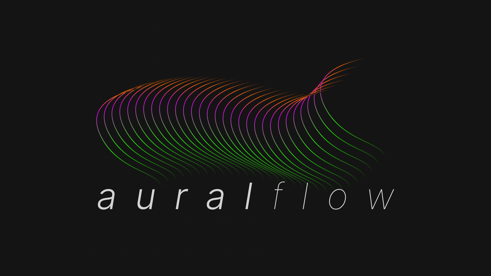

[](https://colab.research.google.com/drive/16IezJ1YXPUPJR5U7XkxfThviT9-JgG4X?usp=sharing)


# Auralflow: A Lightweight BSS Model Toolkit For PyTorch
Auralflow is an all-in-one **blind source separation (BSS)** (also known as
**music source separation**) package designed for PyTorch
integration. It offers ready-to-go, pretrained DL models capable of separating
music tracks into multiple sources: vocals, bass, drums and other. Auralflow
also provides customizable base model architectures, which can be trained 
natively in auralflow or ported to your own custom training pipeline. 
Several convenient training, audio processing, visualization
and evaluation tools are available for a more seamless and efficient workflow.

* [Introduction: What is Source Separation?](#introduction)
* [Pretrained Models](#pretrained-models)
* [Installation](#installation)
* [Command Line Usage](#usage)
  * [Model Configuration](#model-config)
  * [Running Training](#running-training)
  * [Separating Audio](#separating-audio)
* [Notebook Demo](#demo)
* [API Documentation](#documentation)
  * [Models](#models)
  * [Losses](#losses)
  * [Trainer](#trainer)
  * [Datasets](#datasets)
  * [Data Utilities](#data-utils)
  * [Visualization](#visualization)
  * [Training](#training)
  * [Separation](#separation)
  * [Evaluation](#evaluation)
* [Deep Mask Estimation: More on the Mathematics](#deep-mask-estimation)
  * [Short Time Fourier Transform](#stft)
  * [Magnitude and Phase](#magnitude-and-phase)
  * [Masking and Source Estimation](#masking-and-source-estimation)
  * [Optimization](#optimization)
  * [Phase Approximation](#phase-approximation)
* [Contribution](#contribution)
* [License](#license)

TODO:
- [ ] testing
- [ ] train audio-domain models
- [ ] documentation
- [ ] package distribution

## Introduction: What is Source Separation? <a name="introduction"></a>

Source separation is the process of separating an input signal into
separate signals that compose it. In the simplest terms, a signal is a linear
combination of vectors that belong to a (potentially huge dimensional) sub space. 

In the context of music and
machine learning, we can think of music source separation as the task of
determining a rule for splitting an audio track (referred to as a *mixture*)
into its solo instrument signals (each referred to as a  *stem*). While in
theory a perfect decomposition of a mixture would amount to some linear
combination of its source signals, the existence of noise and uncertainty
— both in the digital representation of an audio recording and modeling
— forces us to approximate the source signals. Fortunately, much like small,
imperceivable perturbations in image pixels, some noises are too subtle
in gain, or even completely outside of the frequency range amenable to the
human ear.

Currently, the two most popular methodologies of extracting these source
signals involve source mask estimation in the time-frequency
or ***spectrogram*** domain, and signal reconstruction directly in the
waveform or time-only domain. The former process, while requiring intermediate
data pre-processing and post-processing steps
(introducing noise and uncertainty) allows for more precise learning of
features related to signal frequencies, while the latter process works with
a simpler data representation, but attempts to solve a more difficult task
of reconstructing source signals entirely.

Music source separation is considered a sub-task within the larger branch of
**Music Information Retrieval (MIR)**, and is related to problems like
**speech enhancement**.

While deep mask estimation is theoretically quite similar to semantic
segmentation, there are some aspects related to digital signal processing
(i.e. fourier transform, complex values, phase estimation, filtering, etc.)
that go beyond the scope of deep learning. Thus, the purpose of this package
is to abstract away some of those processes in order to enable faster model
development time and reduce barriers to entry.

## Pretrained Models <a name="pretrained-models"></a>
Auralflow includes several base model architectures that have already been
trained on the musdb18 dataset. The table below compares each model relative to
its **scale-invariant signal-to-distortion ratio (____SI-SDR____)**,
which is averaged across audio tracks from a hidden test set. The choice of using the SI-SDR
over the typical SDR is because it's an unbiased and fairer measurement. 

| Base Model               | # Parameters (MM) | Pretrained | Trainable | Performance (si-sdr in db) |
|--------------------------|-------------------|------------|-----------|----------------------------|
| AudioNetSimple           | 7.9               | yes        | yes       | N/A                        |
| AudioNetSimpleLSTM       | 32.3              | yes        | yes       | N/A                        |
| AudioNetVAE              | 40                | yes        | yes       | N/A                        |
| SpectrogramNetSimple     | 7.9               | yes        | yes       | + 2.9                      |
| SpectrogramNetLSTM       | 32.3              | yes        | yes       | +4.3                       |
| **SpectrogramNetVAE***   | 40                | yes        | yes       | **+5.4**                   |
| HybridNet                | 65.5              | yes        | no        | N/A                        |


The naming of models indicates the type of input data
the model was trained on as well as its underlying architecture:

**Audio**-\* (prefix): model separates audio in the waveform or _time_
  domain.

**Spectrogram**-\* (prefix): model separates audio in the spectrogram or
  _time-frequency_ domain.

**\*-Simple** (suffix): model uses a simple U-Net encoder/decoder architecture.

**\*-LSTM** (suffix): model uses an additional stack of recurrent bottleneck layers.

**\*-VAE** (suffix): model uses a Variational Autoencoder (VAE) + LSTM.

## Installation <a name="installation"></a>
Install auralflow with pip using the following command:
```bash
pip install auralflow
`````

## Command Line Usage <a name="usage"></a>
The quickest way to use auralflow is through shell commands. 

### Model Configuration <a name="model-config"></a>
Auralflow uses a single configuration file in order to store important
training, data processing and model information, among other things. For example,
things like
* model base architecture
* number of filterbanks, hop length or window size
* visualization tools for monitoring training progress

can be customized by simply editing the configuration file belonging to your
model. Let's dive in.
### `config`
To initialize a new configuration file, run the `config` command:
```bash
auralflow config my_model SpectrogramNetSimple --save path/to/save
```
which will create a model folder named `my_model` and copy the starting
template for `SpectrogramNetSimple` as `config.json` to the folder. 
Additionally, we can specify a location
we'd like to save the folder with the `--save` argument. By default,
the folder will be saved in the current directory.

Next, to modify some of the starting settings we can either edit the
`config.json` file in a text editor (recommended), or pass in the desired
value for each argument within the command line like so:
```bash
auralflow config my_model --mask_activation relu --dropout_p 0.4 --display
```
Here, we've changed two parameters simultaneously:
* the model's masking function to ReLU by specifying the `--mask_activation` argument
* the dropout probability for its layers with the `--dropout_p` argument

Any number of [configuration settings](#config-settings) can be changed with
one or more commands. Optionally, the `--display` flag will display your
changes in the terminal output.


## Running Training <a name="running-training"></a>
### `train`
Now that we've configured our model, we can train it by using the `train`
command:
```bash
auralflow train my_model path/to/dataset
```
Note that we must pass in a path to a valid audio dataset to train on. We
can also resume training with the same exact command, which will load the
previous states and train for an additional `max_epochs`.

Depending on the configurations we set, we can expect the contents of our
model folder to look like the following after training is complete.
```bash
my_model
  ├── audio/...
  ├── config.json
  ├── checkpoint/...
  ├── evaluation.csv
  ├── images/...
  └── runs/...
```
where
* `config.json`: the configuration file for model, data and training settings
* `checkpoint`: folder that stores model, optimizer, lr scheduler and gradient scaling states
* `evaluation.cvs`: a printout of the performance of your model using standard
MIR evaluation metrics
* `audio`: folder that stores .wav file snippets of separated audio from validation data
* `images`: folder that stores spectrograms and waveforms of separated audio
from validation data

## Separating Audio <a name="separating-audio"></a>
The separation script allows us to separate a single song or multiple songs
contained in a folder.
### `separate`
To separate audio using our model, use the `separate` command:
```bash
auralflow separate my_model path/to/audio --residual --duration 90 \
--save path/to/output
```
Here we've specified a few things:
* to save the residual or background track along with the `--residual` flag
* to only save the first 90 seconds of the results with the `--duration` argument
* where to save the results with the `--save` argument

The results for each track will placed within a single folder called
`separated_audio` like so:
```bash
path/to/save/separated_audio
  └── artist - track name
        ├── original.wav
        ├── vocals.wav
        └── residual.wav
```
And we're done! If you'd like for more control and functionality, read the
[documentation](#documentation). 
## [Notebook Demo](https://colab.research.google.com/drive/16IezJ1YXPUPJR5U7XkxfThviT9-JgG4X?usp=sharing) <a name="demo"></a> 
A walk-through involving training a model to separate vocals can be found [here](https://colab.research.google.com/drive/16IezJ1YXPUPJR5U7XkxfThviT9-JgG4X?usp=sharing).
 

## Deep Mask Estimation: Brief Math Overview <a name="deep-mask-estimation"></a>
### Short Time Fourier Transform <a name="stft"></a>
Let $\Huge A \in \mathbb{R}^{c, t}$ be an audio waveform with $\Huge c$
channels, and $\Huge t$ samples, normalized such that the value of each
sample (aka amplitude) $\Huge a_i \in [-1, 1]$.

Let $\Huge f: A ↦ X$ be an linear transformation, mapping an audio signal $\Huge A$
to a complex-valued time-frequency representation $\Huge X \in \mathbb{C}^{c, f, τ}$,
with $\Huge f$ filterbanks, and $\Huge τ$ number of frames. $\Huge X$ is often referred to as
a ***spectrogram***.

Similarly, let $\Huge f^{-1}: Y ↦ S$ be the inverse transformation mapping a
spectrogram $\Huge Y \in \mathbb{C}^{c, f, τ}$ to its audio signal
$\Huge S \in \mathbb{R}^{c, t}$. As was alluded to in the introduction, the
existence of noise and uncertainty ensure that $$\Huge f^{-1}(f(A)) \neq A$$
However, by carefully choosing a good transformation $f$, we can minimize the
unknown additive noise factor $\Huge E_{noise}$, such that
$$\Huge f^{-1}(f(A)) = A + E_{noise} \approx A$$

Without going into much detail, $\Huge f$ is an approximation algorithm to the
**Discrete Fourier Transform (DFT)** called the
**Short-Time Fourier Transform (STFT)**, which is a parameterized windowing
function that applies the DFT
to small, overlapping segments of $\Huge X$. As a disclaimer, $\Huge f$ has been trivially
extended to have a channel dimension, although this is not part of the
canonical convention.

### Magnitude and Phase <a name="magnitude-and-phase"></a>
Given a spectrogram $\Huge X$, its magnitude is defined as $\Huge |X|$, and its phase is
defined as $\Huge P:= ∠_{\theta} X$, the element-wise angle of each complex entry.
We use $\Huge |X|$ as input to our model, and use $\Huge P$ to employ a useful trick that
I will describe next that makes our task much simpler.

### Masking and Source Estimation <a name="masking-and-source-estimation"></a>
To estimate a target signal $\Huge k$, we apply the transformation to a mini-batch
of mixture-target audio pairs $\Huge (A, S_{k})$. yielding $\Huge (|X|, |Y_{k}|)$. We feed
$\Huge |X|$ into our network, which estimates a multiplicative soft-mask
$M_{\theta}$, normalized such that $\Huge m_{i} \in \[0, 1]$. Next, $\Huge M_{\theta}$ is
*applied* to $\Huge |X|$, such that $$\Huge |\hat{Y_{k}}| = M_{\theta} \odot |X|$$
where $\Huge \odot$ is the Hadamard product, and $\Huge |\hat{Y}_{k}|$ is the network's
estimate of $\Huge |Y_k|$.

### Optimization <a name="optimization"></a>

Let $\Huge L$ be some loss criterion. The objective is to find an optimal choice of
model parameters $\Huge \theta^{\*}$ that minimize the loss
$$ \Huge \theta^{\*} = \arg\min_{\theta} L(|\hat{Y_{k}}|, |Y_{k}|)$$

In recent literature, the most common loss criterions employed are
*mean absolute loss* and *mean squared error* (MSE), paired with optimizers
such as *SGD* or *Adam*.

### Phase Approximation <a name="phase-approximation"></a>
Without prior knowledge, it may not be clear how to transform the source
estimate $\Huge |\hat{Y_{k}}|$ to a complex-valued spectrogram. Indeed, this is
where the second source separation method shines, as it avoids this
predicament altogether. There are known (but rather complicated) ways of
phase estimation such as [Griffin-Lim](http://citeseerx.ist.psu.edu/viewdoc/download?doi=10.1.1.306.7858&rep=rep1&type=pdf).
As I mentioned earlier, there is a quick-and-dirty trick that works pretty
well. Put simply, we use the phase information of the mixture audio to estimate
the phase information of the source estimate. Given $\Huge |\hat{Y}_{k}|$ and $P$,
we define the phase-corrected source estimate as:

$$\Huge \bar{Y_{i}} = |\hat{Y_{k}}| ⊙ {\rm exp}(j \cdot P)$$

where $ \Huge j$ is imaginary.

The last necessary calculation transports data from the time-frequency domain
back to the audio signal domain. All that is required is to apply the inverse
STFT to the phase-corrected estimate, which yields the audio signal estimate
$\Huge \hat{S}_{k}$:

$$\Huge \hat{S}_{k} = f^{-1}(\bar{Y}_{k})$$

If the noise is indeed small, such that $\Huge ||\hat{S_{k}} - {S}_{k}|| < ϵ$ for
some small $\Huge ϵ$, and our model has not been overfit to the training data,
then we've objectively solved our task — the separated audio must sound good
to our ears as well.

## License <a name="license"></a>
[MIT](LICENSE)
